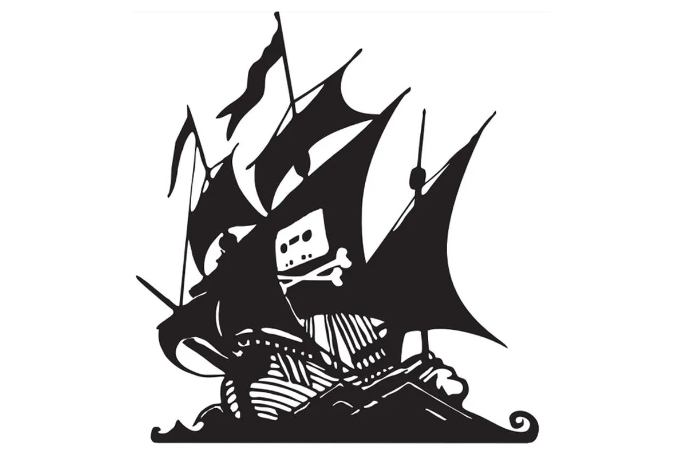

<!-- PROJECT LOGO -->
 

  
  <h3 align="center">🏴‍☠️ Pirate All-In-One!</h3>
  

    An all-in-one (AIO) pirating service for automated personal audio and video recording!
     
    <a href="https://github.com/scallywag-xxix/pirate-aio"><strong>Explore the docs »</strong></a>
     
     
    <a href="https://agile.scallywag.io/projects/pirate-project/">View Project</a>
    ·
    <a href="https://github.com/scallywag-xxix/pirate-aio/issues">Report Bug</a>
    ·
    <a href="https://github.com/scallywag-xxix/pirate-aio/issues">Request Feature</a>
  

<!-- TABLE OF CONTENTS -->

  
Table of Contents

  <ol>
    <li>
      <a href="#about-the-project">About The Project</a>
      <ul>
        <li><a href="#built-with">Built With</a></li>
      </ul>
    </li>
    <li>
      <a href="#getting-started">Getting Started</a>
      <ul>
        <li><a href="#prerequisites">Prerequisites</a></li>
        <li><a href="#installation">Installation</a></li>
      </ul>
    </li>
    <li><a href="#usage">Usage</a></li>
    <li><a href="#roadmap">Roadmap</a></li>
    <li><a href="#contributing">Contributing</a></li>
    <li><a href="#license">License</a></li>
    <li><a href="#contact">Contact</a></li>
  </ol>

<!-- ABOUT THE PROJECT -->
## About The Project
There are many services to download and host media and it can become difficult to maintain after years of standard maintenance, updates, and scaling changes. This project aims to store all pirating services safely in source control as well as simplifies complex service stacks using modern technologies like Docker Compose. 

(<a href="#readme-top">back to top</a>)

### Built With
* [![Docker][docker-shield]][docker-url]
* [![Linux][linux-shield]][linux-url]

(<a href="#readme-top">back to top</a>)

<!-- GETTING STARTED -->
## Getting Started
Start by installing Docker and Docker Compose.

*Optional:* Create SAMBA/NFS share to store `config` directories.

<!-- Prerequisities -->
### Prerequisites
* Docker
* Docker Compose
* Domain Name *(preferably CloudFlare)*
* Firewall
  * Port Forward TCP/80 & TCP/443

### Installation
- Install Docker: `Install`
- Install Docker Compose: `Install`

(<a href="#readme-top">back to top</a>)

<!-- USAGE EXAMPLES -->
## Usage
1. Clone the repo: `git clone https://github.com/scallywag-xxix/pirate-aio.git`
2. To pull the latest Docker images: `sudo docker-compose pull`
3. Start the stack: `sudo docker-compose up -d`
4. Stop the stack: `sudo docker-compose stop`

(<a href="#readme-top">back to top</a>)

<!-- CONTRIBUTING -->
## Contributing
If you have a suggestion that would make this better, please fork the repo and create a pull request. You can also simply open an issue with the tag "enhancement".
Don't forget to give the project a star! Thanks again!

1. Fork the Project
2. Create your Feature Branch (`git checkout -b feature/project-id`)
3. Commit your Changes (`git commit -m 'Add the thing'`)
4. Push to the Branch (`git push origin feature/project-id`)
5. Open a Pull Request

(<a href="#readme-top">back to top</a>)

<!-- LICENSE -->
## License
Distributed under the MIT License. See [LICENSE.txt][license-url] for more information.

(<a href="#readme-top">back to top</a>)

<!-- CONTACT -->
## Contact
Scally - [@scallywag-xxix](https://github.com/scallywag-xxix) - ii-ix-bot@protonmail.com

(<a href="#readme-top">back to top</a>)

<!-- ROADMAP -->
## Roadmap

| Service Name   | Description                                                     | OpenProject ID     | Status        |
| -------------- | --------------------------------------------------------------- | -----------------  | ------------- |
| SABnzbd        | `NZB` download client support for usenet newsgroups             | [PIRATE-50][rm01]  | ✅ Complete   |
| qBittorrent    | `Torrent` download client support for private trackers          | [PIRATE-56][rm02]  | ✅ Complete   |
| Bazarr         | `Subtitles` companion application client support                | [PIRATE-73][rm03]  | ✅ Complete   |
| Jackett        | `API Download Client` companion application client support      | [PIRATE-78][rm04]  | ✅ Complete   |
| Lidarr         | `Music` PVR client support                                      | [PIRATE-84][rm05]  | ✅ Complete   |
| Radarr         | `Movie/Cinema` PVR client support                               | [PIRATE-61][rm06]  | ✅ Complete   |
| Readarr        | `eBook` PVR client support                                      | [PIRATE-89][rm07]  | ✅ Complete   |
| Sonarr         | `Television` PVR client support                                 | [PIRATE-67][rm08]  | ✅ Complete   |
| Tdarr          | `Transcode` companion application client support                | [PIRATE-94][rm09]  | ✅ Complete   |
| Overseerr      | `Request` companion application client support                  | [PIRATE-100][rm10] | ✅ Complete   |

See the [open issues](https://github.com/scallywag-xxix/pirate-aio/issues) for a full list of proposed features (and known issues).

(<a href="#readme-top">back to top</a>)

<!-- MARKDOWN LINKS & IMAGES -->
  [license-url]: LICENSE.txt
  <!-- Roadmap Links -->
  [rm01]: https://agile.scallywag.io/projects/pirate-project/work_packages/50/
  [rm02]: https://agile.scallywag.io/projects/pirate-project/work_packages/56/
  [rm03]: https://agile.scallywag.io/projects/pirate-project/work_packages/73/
  [rm04]: https://agile.scallywag.io/projects/pirate-project/work_packages/78/
  [rm05]: https://agile.scallywag.io/projects/pirate-project/work_packages/84/
  [rm06]: https://agile.scallywag.io/projects/pirate-project/work_packages/61/
  [rm07]: https://agile.scallywag.io/projects/pirate-project/work_packages/89/
  [rm08]: https://agile.scallywag.io/projects/pirate-project/work_packages/67/
  [rm09]: https://agile.scallywag.io/projects/pirate-project/work_packages/94/
  [rm10]: https://agile.scallywag.io/projects/pirate-project/work_packages/100/

  <!-- Shields -->
  [docker-shield]: https://img.shields.io/badge/Docker-%5E20.10.21-green?style=appveyor&logo=docker
  [docker-url]:    https://docs.docker.com/compose/
  [linux-shield]:  https://img.shields.io/badge/Linux-%5E22.04.1-blue?style=appveyor&logo=linux
  [linux-url]:     https://docs.ubuntu.com/